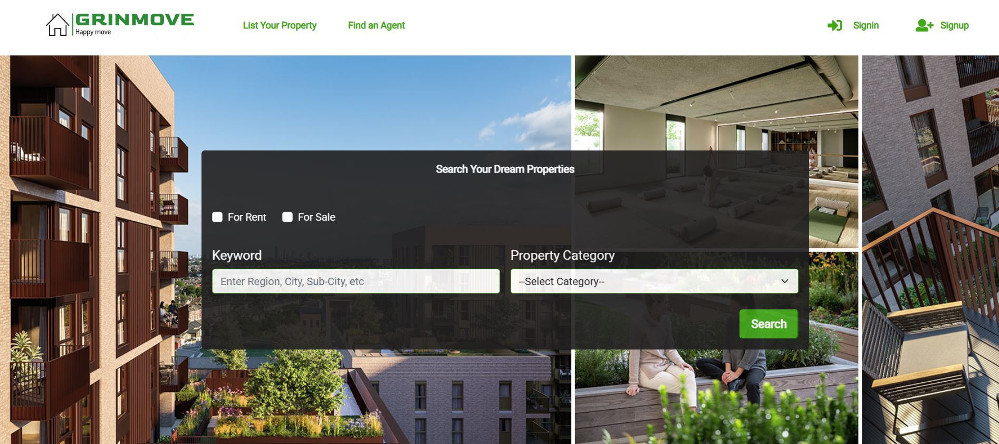
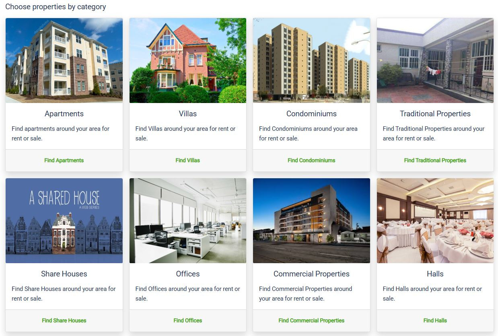
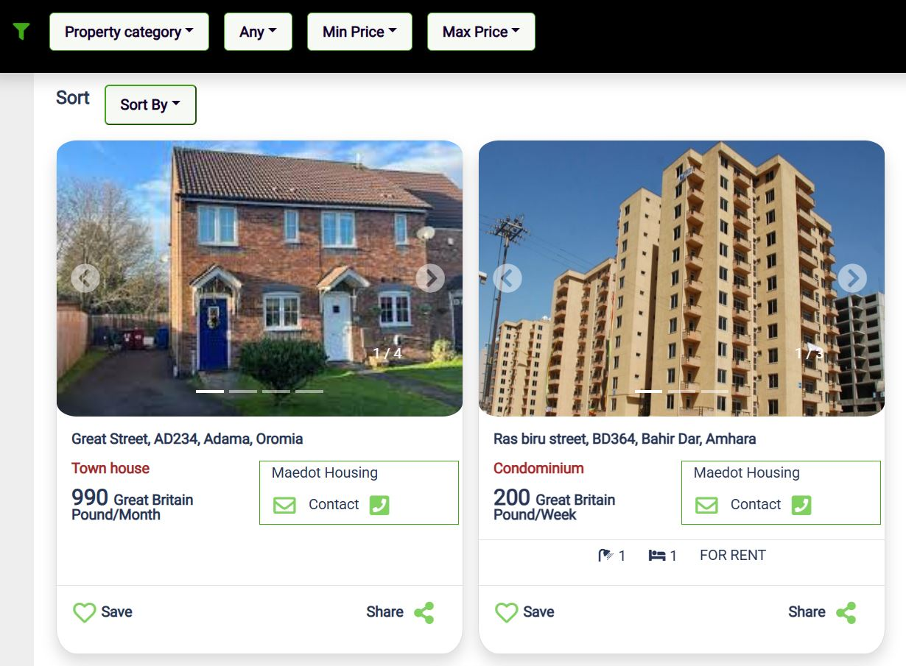

# Frontend of Grinmove property listing website

This is the Frontend part of the Grinmove online property listing website. The frontend uses APIs developed using Axios which sends request and recieves responses to/from the backend developed
with Django Rest Framework. The frontend GUI is developed with JavaScript, React and Bootstrap.

# Languages and Frameworks Used

- JavaScript
- React
- Bootstrap

## Website [Link Here](https://grinmovefrontend.web.app/)

